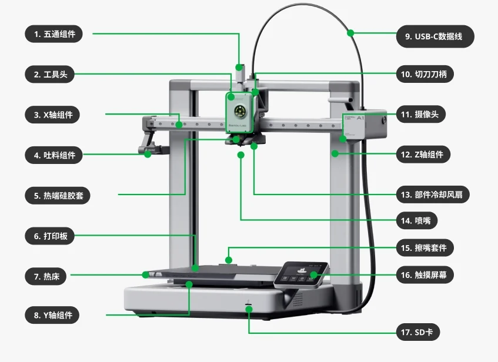
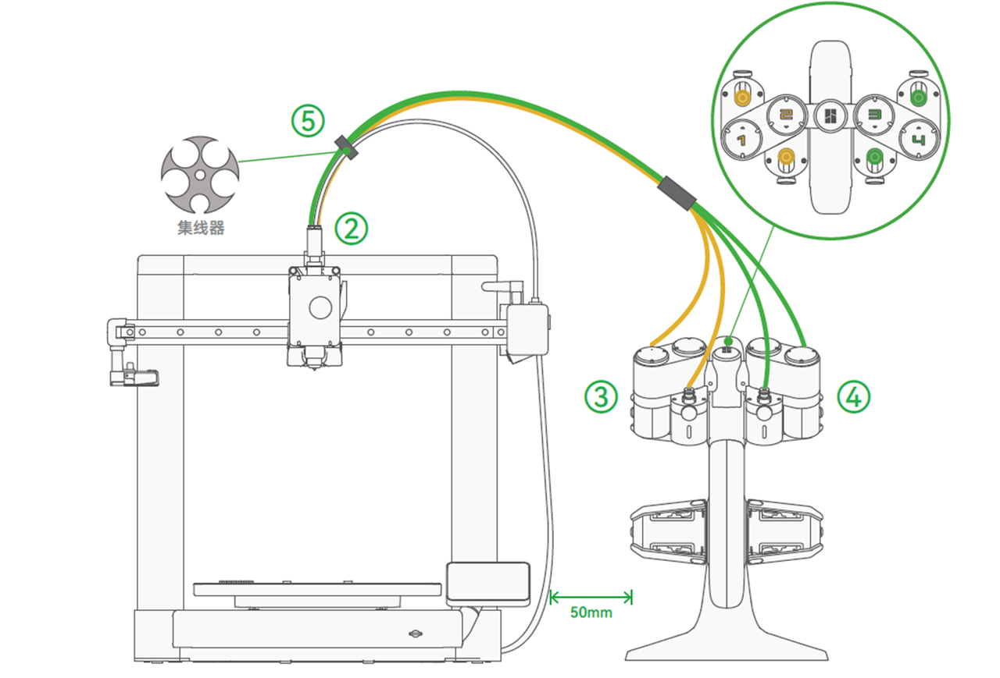

# Bambu 3D 打印机

#### 目录

> - A1 使用
> - 官方切片软件
> - 首先打印维护模型
> - 模型
>     - 拓竹社区

- A1 使用
- 官方切片软件
- 首先打印维护模型
- 模型
    - 拓竹社区

# A1 使用

- [官方 wiki](https://wiki.bambulab.com/zh/a1)
- A1 简介
- A1 可以做什么
- 注意事项
- 维护
- 消耗品
    - 打印机组件
    - 耗材
- 更换零件

## A1 简介

A1 采用了笛卡尔坐标运动系统，最大打印体积是256 * 256 * 256 mm$^3$，其运动系统包括以下组件：

- X轴运动系统由一根高精度线轨和一根横梁组成。打印头固定在线轨滑块上，而滑块则可以在水平线轨上自由滑动。通过控制滑块的左右运动，打印头可以在X轴上精准移动。
- Y轴运动系统由一根高精度水平导轨和一个打印平台组成。打印平台固定在导轨滑块上，而滑块可以在水平导轨上自由滑动。通过控制滑块的前后运动，打印平台可以在Y轴上精准移动。
- Z轴运动系统用于控制打印头相对于打印平台的垂直位置。它由双光轴-直线轴承导向组件、双丝杆螺母、步进电机和同步带驱动组件组成。双丝杆通过同步带与步进电机串联，实现两根丝杆的同步运动。此外，同步带配备有快速张紧器，并结合张紧力检测算法，确保同步带在最佳张力范围内运动，从而保证打印头在Z轴方向上的精准且稳定的移动。

A1 标配了一张纹理PEI打印板（开箱包装清单内）由PEI材料喷涂在不锈钢板上而成，能够给打印件的底部带来特殊的纹理质感。该打印面板能够用于打印PLA/PETG/TPU等各类材料，并无需使用任何的粘合剂。打印完成后须等待打印板充分冷却后再拆除打印件。建议定期清洁打印板以保持最佳的粘附力。同时尽量减少手指直接触碰打印板表面的情况，以防止皮肤油脂附着到打印板表面，影响打印板对材料的粘附力。

## A1 可以做什么

### A1 可以打印哪些耗材？

1. **PLA** 类，**PETG** 类，**TPU** 类，PLA、PETG 的支撑类（Support for PLA，PVA，HIPS 等）等低温料。
2. ABS、ASA、PC、PA、PA-CF/GF、PET-CF/GF、PPA-CF/GF 等常规高温料。

注意：

1. 标配喷嘴为不锈钢喷嘴，要打印 PLA-CF/GF、PLA 夜光（PLA Glow-in-the-dark）、PETG-CF/GF、PAHT-CF/GF 等含有硬质颗粒（CF、GF 等 ）的耗材时，需要更换为硬化钢喷嘴，以免喷嘴过快磨损。
2. 因为 A1 为开放式机型，虽然热床温度上限为 100 ℃，但腔温低，易造成高温耗材的层间强度因过度冷却而变得很低，也易造成大尺寸模型有更高的翘曲风险、更大的翘曲幅度，所以不推荐在 A1 上用 ABS、ASA、PC、PA、PA-CF/GF、PET-CF/GF、PPA-CF/GF 等常规高温耗材来打印要对层间强度要求较高的、大尺寸和（或）高填充密度的模型，但可以在 A1 上用这些高温耗材打印一般的小尺寸、低填充率的模型，打印效果与耗材干湿状态、模型本身特点、打印参数、环境温度等有关。

### A1 支持的最高喷嘴和热床温度是多少？

最高喷嘴温度为 300 ℃，最高加热床温度为 100 ℃。

### A1 配件盒中的润滑油和润滑脂有什么区别？

考虑到一些用户反馈润滑脂的黏稠性可能会引起灰尘和碎屑问题，**经过反复验证测试后，我们决定更换A1机型Y轴导轨的润滑剂。因此，对于A1型号的Y轴导轨，我们建议使用润滑油进行润滑。如果您之前已经使用了润滑脂，在以后的保养中，我们建议您改用润滑油进行润滑。**在进行润滑的过程中，您也可以先擦除导轨上的润滑脂，然后按照视频指南重新涂抹润滑油。

润滑油的用途：用于X轴线轨、Y导轨和惰轮消异音之类的 。

润滑脂的用途：用于润滑丝杆和挤出轮。**请注意，严禁将润滑脂用于 X 轴线轨上。**

### A1 可以打印含碳纤维（CF）、玻璃纤维（GF）类的耗材吗？

A1 打印机已预装了一个直径为 0.4mm 的不锈钢喷嘴。为了减少喷嘴过度磨损，不建议使用不锈钢喷嘴打印含有碳纤维或玻璃纤维等硬质颗粒的耗材，如 PLA-CF/GF、PLA 夜光（PLA Glow-in-the-dark）、PETG-CF/GF、PAHT-CF/GF 等。但是，如果您将喷嘴更换为硬化钢材料，就可以在 A1 上打印这些耗材了。如果您希望在 A1 上使用 AMS lite 进行耗材进料，请遵循 AMS lite 对耗材的要求。

### A1 可以打印 ABS、ASA 吗？

因为 A1 为开放式机型，腔温低，易造成高温耗材的层间强度因过度冷却而变得很低，也易造成大尺寸模型有更高的翘曲风险、更大的翘曲幅度，所以不推荐在 A1 上用 ABS、ASA、PC、PA、PA-CF/GF、PET-CF/GF、PPA-CF/GF 等常规高温耗材打印要对层间强度要求较高的、大尺寸和（或）高填充密度的模型，但可以在 A1 上用这些高温耗材打印一般的小尺寸、低填充率的模型，打印效果与耗材干湿状态、模型本身特点、打印参数、环境温度等有关。

另外，由于 ABS、ASA 在打印过程会释放出有害的、带刺激性气味的气体，因此对空气过滤和通风有较高的要求，而 A1 打印机属于不带空气封闭、净化功能的开放式打印机，因此我们建议您不使用 A1 打印机来打印 ABS、ASA，或在通风条件较好的、与人有一定距离的环境内打印。

### A1 可以使用 AMS 吗？

AMS 和 A1 不适配，如果你想在 A1 上实现多色打印，你需要使用 AMS lite。

### 应该如何摆放 A1 和 AMS lite?

建议按照下图的方式摆放 A1 和 AMS lite，并保持两者之间留有 5 cm 左右的空隙。

### 对于A1 + AMS lite，在X、Y和Z轴方向上，整体的空间要求尺寸是多少？

### A1移动热床到打印机的前面和后面时，需要预留多少空间？

如图所示，放置打印机时，请在 Y 方向上留出足够热床移动的安全空间，约195 mm + 90 mm+ 410 mm = 695 mm。

### A1 支持什么打印板？

A1 开箱时附送一张纹理PEI板。需要注意的是，虽然官方商店提供了与A1相同尺寸的Smooth PEI板或其他打印板，但由于它们在A1热床上的磁性吸附力稍弱，我们不建议用户在A1上使用除Bambu Lab纹理PEI板之外的打印板，除非用户对热床的磁性吸附力要求不高。

### 纹理板PEI板可以用于打印哪些材料？

纹理 PEI 板可以打印 PLA、PETG 和 TPU，且不需要涂胶（清洁状态下）。打印完成后，请等待打印平台完全冷却后再取下打印模型。建议用温水和普通肥皂清洁打印板，以保持最佳附着力。

### A1 可以在没有 micro SD 卡的情况下，使用 Bambu Studio/Handy 发起打印吗？

A1 没有内置存储器，因此您必须插入micro SD 卡才能发起打印任务。打印机预装了一张 32 GB的 Micro SD 卡。

### 打印机最大可兼容的 SD 卡容量是多少？

A1 可支持高达 2 TB 容量的 micro SD卡。您可以浏览此[页面](https://wiki.bambulab.com/zh/general/micro-sd-faq)，获取关于更多 micro SD 卡常见问题。

### 打印机屏幕上方的白色 LED 指示灯的作用是什么？

白色 LED 闪烁表示有需要查看的AI助手消息，即可能有异常信息通知；白色光常亮表示系统状态正常。

## 维护

https://wiki.bambulab.com/zh/a1-mini/maintenance/lubricate-y-axis-with-wd-40-multi-use-product

# 首先打印维护模型

- [集线器](https://makerworld.com/zh/models/96692?from=search#profileId-103109)
- [线缆弹性导管](https://makerworld.com/zh/models/208664#profileId-247933)
- [润滑油工具套装](https://makerworld.com/zh/models/119774?from=search#profileId-128863)
- [铁氟龙管移除器](https://makerworld.com/zh/models/79328?from=search#profileId-83766)
- [铲子](https://makerworld.com/zh/models/12702#profileId-12703)
- 废料盒
    - [小型悬挂](https://makerworld.com/zh/models/451897?from=search#profileId-416433)
    - [底部放置，自带挡板](https://makerworld.com/zh/models/104677#profileId-111711)

