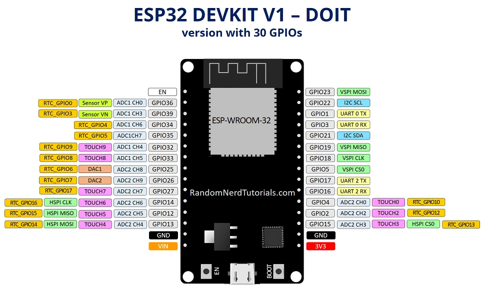

# ESP32-DevKitC

- 官方文档 v4：https://docs.espressif.com/projects/esp-dev-kits/zh_CN/latest/esp32/esp32-devkitc/user_guide.html
    - 核心模组没换，都是 ESP-WROOM-32，故而文档可看，只是开发板引脚不同
- https://docs.geeksman.com/esp32/Arduino/01.esp32-arduino-intro.html

v1-30pin

